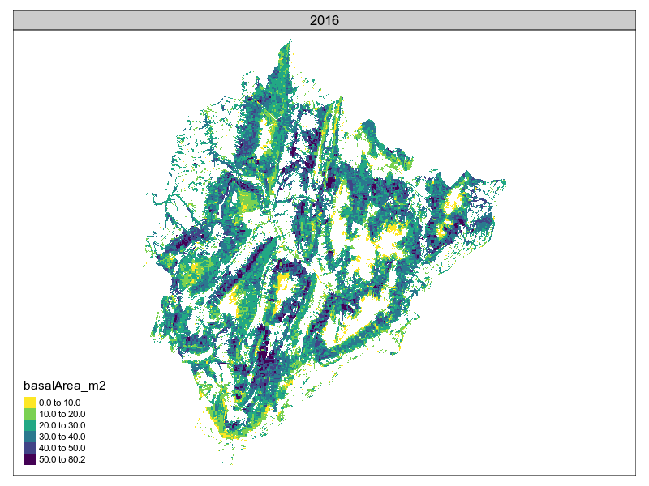

  
```{r setup, include=FALSE}
rm(list=setdiff(ls(), c("params")))
library(knitr)
knitr::opts_chunk$set(echo = TRUE, fig.width=12, fig.height=8)
# library(kableExtra)
#library(rgl)
#knit_hooks$set(webgl = hook_webgl)
options(scipen=999)
# wkhtmltopdf -B 15 -L 15 -R 15 -T 15 fiche-observatoire.html fiche-observatoire.pdf
# load packages
library(ggplot2)
library(plyr)
#
# set work directory
setwd("/home/jean-matthieu/R/PROTEST")# "/media/data/R/packages/PROTEST")#

```

---
# Introduction

L'objectif de ce document est de présenter les simulations d'évolution forestière réalisées par le logiciel SIMMEM sur le territoire du PNR du Massif des Bauges. 


```{r charge.donnees.initiales, echo=FALSE, warning=FALSE, message=FALSE}
# load full file
forestStands <- read.table(paste0("./output/forestStandsFULL", params$scenario,".txt"), header=TRUE, sep = '\t', dec=".")
forestStands$WKT.GEOM <- as.character(forestStands$WKT.GEOM)
forestStands <- sf::st_sf(forestStands[,-which(names(forestStands)=="WKT.GEOM")], geom=sf::st_as_sfc(forestStands$WKT.GEOM))
sf::st_crs(forestStands) <- 2154
#
# format names
# typologie
levels(forestStands$typologie) <- gsub("Priv", "Privé", levels(forestStands$typologie))
levels(forestStands$typologie) <- gsub("Pub", "Public", levels(forestStands$typologie))
# gestion
levels(forestStands$gestion) <- gsub("AccGere", "Accessible-géré", levels(forestStands$gestion))
levels(forestStands$gestion) <- gsub("AccNonGere", "Accessible-non géré", levels(forestStands$gestion))
levels(forestStands$gestion) <- gsub("NonAcc", "Non accessible", levels(forestStands$gestion))
levels(forestStands$gestion) <- gsub("NonBuch", "Non bûcheronnable", levels(forestStands$gestion))
# itineraire
forestStands$itineraire <- factor(ifelse(substr(forestStands$COMMENT,1,2)=="Co", "Inaction",
                                  ifelse(substr(forestStands$COMMENT,1,2)=="Ir", "Irrégulier",
                                         ifelse(substr(forestStands$COMMENT,1,2)=="Th", "Amélioration","Coupe rase"))))
```

Le nombre de polygones simulés est de `r nrow(forestStands)`, pour une surface totale de `r round(sum(forestStands$AREA)/10000,-1)` ha. 

```{r charger.simus, echo=FALSE, warning=FALSE, message=FALSE}
#
# simulation parameters
# 
duration <- 30
# time step = 3 yrs
timeStep <- 3
#
# load SIMMEM output file
df <- read.csv(file=paste0("./simmem/simmemOutput/exportAuto", params$scenario, ".txt"), sep = "\t", skip = 3)
colnames(df)[1] <- "standId"
#
# load SIMMEM input file to retrieve plot surface
# forestStands <- read.csv(file="./output/forestStands.txt", sep = "\t", skip = 8)
# colnames(forestStands)[1] <- "STAND_ID"

###############################################################
# manage format
###############################################################

# create columns for sp2
df$realSpecies2 <- -1
df$Ddom2 <- -1

# separate sp1 and sp2 data
df[df$realSpecies == 'Fagus sylvatica;Picea abies', 'realSpecies2'] <- 'Picea abies'
df[df$realSpecies == 'Fagus sylvatica;Abies alba', 'realSpecies2'] <- 'Abies alba'
df[df$realSpecies == 'Abies alba;Picea abies', 'realSpecies2'] <- 'Picea abies'

colnames(df)[colnames(df) == "realSpecies"] <- "realSpecies1"
df[df$realSpecies1 == 'Fagus sylvatica;Picea abies', 'realSpecies1'] <- 'Fagus sylvatica'
df[df$realSpecies1 == 'Fagus sylvatica;Abies alba', 'realSpecies1'] <- 'Fagus sylvatica'
df[df$realSpecies1 == 'Abies alba;Picea abies', 'realSpecies1'] <- 'Abies alba'

# TODO: separate Ddom1 and Ddom2

# retrieve area
df <- merge(df, forestStands[,c("STAND_ID", "AREA")], by.x = "standId", by.y = "STAND_ID")
# managType
df$managType <- substr(df$comment, 1, 3)
# compo
df$compo <- substr(df$comment, 4, 6)
# owner
df$owner <- substr(df$comment, 7, 8)
# order by standId and then by date
df <- df[order(df$standId, df$date), ]
```
On s'intéresse à une durée simulée de `r duration` années, avec une période simulée de 3 ans.

Dans le cas de la coupe rase, SIMMEM répète à chaque intervalle les valeurs du dernier volume exploité dans le fichier de sortie. Les valeurs en doublon sont enlevées du tableau de résultats. Aucune exploitation n'est réalisée lors de la dernière année de simulation, une année supplémentaire est donc simulée puis enlevée avant les analyses.

Dans le fichier de sortie de SIMEMM, une ligne par année est indiquée. La première année reprend les valeurs initiales. Une intervention est éventuellement déclenchée dès la première année. Ce sont donc les caractéristiques du peuplement avant intervention qui sont indiquées. Les caractéristiques du peuplement juste après intervention ne sont pas disponibles, la ligne suivante présentant les caractéristiques du peuplement après intervention éventuelle et croissance du peuplement pendant la période de simulation suivante.

```{r enlever.doublons.exploitation, echo=FALSE, warning=FALSE, message=FALSE}
###############################################################
# remove repeated clearcut
###############################################################
if(1)
{
  # order df by standid then date
  df <- df[order(df$standId, df$date),]
  testStand <- df$standId[1:(nrow(df)-1)]==df$standId[2:nrow(df)]
  testYear <- df$date[1:(nrow(df)-1)]==df$date[2:nrow(df)]-3
  testVolume <- df$volumeRemoved_m3[1:(nrow(df)-1)]==df$volumeRemoved_m3[2:nrow(df)]
  testVolumeZero <- df$volumeRemoved_m3[-nrow(df)]!=0
  # testManagTyp <- df$managType[-nrow(df)]=="Har"
  # testBasalArea <- df$basalArea_m2[1:(nrow(df)-1)]>=df$basalArea_m2[2:nrow(df)]
  falseVolume <- which(testStand & testVolume & testVolumeZero & testYear)
  df$volumeRemoved_m3[falseVolume+1] <- 0
  #
  # test volume removed while ba increases
  # which(df$basalArea_m2[1:(nrow(df)-1)]<=df$basalArea_m2[2:nrow(df)] & df$volumeRemoved_m3[-nrow(df)] >0)
  # 
  # sum(df$volumeRemoved_m3[df$managType=="Har"])
}

# remove last year
# df <- df[df$date!=max(df$date),]

# keep only 30 years
df <- df[df$date<min(df$date)+duration,]
#
```

# Dendrométrie des polygones

Les graphiques suivantes montrent l'évolution du RDI et de la surface terrière pour chaque polygone, pour les différents itinéraires (en colonne) :

* Con : inaction
- Har : coupe rase
- Ir1, Ir2 et Ir3 : irrégulier clair, moyen et dense,
- Th1 et Th2 : amélioration clair et dense.

et différentes compositions (en ligne) :

* bee : hêtre
- bfs : mixte
- fsp : sapin et/ou épicéa
- oak : autres feuillus


```{r evolution.RDI, echo=FALSE, warning=FALSE, message=FALSE}
###############################################################
# density (rdi)
###############################################################
df$standColor <- as.numeric(as.factor(df$standId))
# RDI
ggplot(data = df, aes(x = date, y = density_01, group = standId, col = standId)) +
  geom_line() +
  scale_color_gradient2(low="blue", mid="green", high="red", midpoint = mean(df$standColor)) +
  # geom_point() +
  facet_grid(compo ~ managType)
```

```{r evolution.G, echo=FALSE, warning=FALSE, message=FALSE}
###############################################################
# basal area
###############################################################
ggplot(data = df, aes(x = date, y = basalArea_m2, group = standId, col = standId)) +
  geom_line() +
  scale_color_gradient2(low="blue", mid="green", high="red", midpoint = mean(df$standColor)) +
  # geom_point() +
  facet_grid(compo ~ managType)
```

# Exploitation

## Évolution des volumes exploités et surfaces traitées

Les graphique suivants montrent l'évolution des volumes exploités et des surfaces traitées (une éclaircie ou coupe réalisée) pendant la période simulée. La forte valeur de la première année correspond aux coupes de rattrapage liées au fait que des polygones aux caractéristiques très diverses sont engagés dans des itinéraires sylvicoles n'autorisant pas de variabilité hors des plages autorisées. Cette forte valeur initiale est suivie par une valeur plus faible lors du cycle simulé suivant.

```{r evolution.total, echo=FALSE, warning=FALSE, message=FALSE}
par(mfrow=c(1,2))
# récolte annuelle
# multiply volume * area / 3 yrs
df$annualVolumeRemoved_m3 <- df$volumeRemoved_m3 * (df$AREA / 10000) / timeStep

# surface traitée annuellement
df$annualAREA <- (df$AREA / 10000) / timeStep
df[df$annualVolumeRemoved_m3 == 0, "annualAREA"] <- 0

# total volume removed each year
voltot <- ddply(df[df$volumeRemoved_m3 > 0,], .(date), summarise, vol = sum(annualVolumeRemoved_m3))
plot(voltot$vol ~ voltot$date, pch = 16, ylab = "volume exploité ou éclairci", xlab = "")
lines(voltot$vol ~ voltot$date)

# total area harvested/thinned each year
areatot <- ddply(df[df$volumeRemoved_m3 > 0,], .(date), summarise, area = sum(annualAREA))
plot(areatot$area ~ areatot$date, pch = 16, ylab = "surface exploitée - éclaircie", xlab = "")
lines(areatot$area ~ areatot$date)
```
La récolte annuelle moyenne sur l'ensemble de la période simulée est de `r round(mean(aggregate(df$annualVolumeRemoved_m3, list(df$date), FUN=sum)$x),-3)` m^3^/an pour une surface traitée de `r round(mean(aggregate(df$annualAREA, list(df$date), FUN=sum)$x), -2)` ha/an.

### Par itinéraire sylvicole

```{r evolution.managType, echo=FALSE, warning=FALSE, message=FALSE}
# volume removed each year for each managtype
voltot <- ddply(df[df$volumeRemoved_m3 > 0,], .(date, managType), summarise, vol = sum(annualVolumeRemoved_m3))
g1 <- ggplot(data = voltot, aes(x = date, y = vol, group = managType, col = managType)) +
  geom_line() +
  geom_point()

# total area harvested/thinned each year for each managType
area <- ddply(df[df$volumeRemoved_m3 > 0,], .(date, managType), summarise, area = sum(annualAREA))
g2 <- ggplot(data = area, aes(x = date, y = area, group = managType, col = managType)) +
  geom_line() +
  geom_point()

cowplot::plot_grid(g1, g2, labels="AUTO")
```

### Par composition en essence

```{r evolution.Composition, echo=FALSE, warning=FALSE, message=FALSE}
# volume removed each year for each compo type
voltot <- ddply(df[df$volumeRemoved_m3 > 0,], .(date, compo), summarise, vol = sum(annualVolumeRemoved_m3))
g1 <- ggplot(data = voltot, aes(x = date, y = vol, group = compo, col = compo)) +
  geom_line() +
  geom_point()

# surface harvested each year for each compo type
areaPP <- ddply(df[df$volumeRemoved_m3 > 0,], .(date, compo), summarise, area = sum(annualAREA))
g2 <- ggplot(data = areaPP, aes(x = date, y = area, group = compo, col = compo)) +
  geom_line() +
  geom_point()

cowplot::plot_grid(g1, g2, labels="AUTO")
```

### Par propriété

```{r evolution.ownership, echo=FALSE, warning=FALSE, message=FALSE}

# volume removed each year for each ownership type
voltot <- ddply(df[df$volumeRemoved_m3 > 0,], .(date, domainType), summarise, vol = sum(annualVolumeRemoved_m3))
g1 <- ggplot(data = voltot, aes(x = date, y = vol, group = domainType, col = domainType)) +
  geom_line() +
  geom_point()


# surface harvested each year for each ownership type
areaPP <- ddply(df[df$volumeRemoved_m3 > 0,], .(date, domainType), summarise, area = sum(annualAREA))
g2 <- ggplot(data = areaPP, aes(x = date, y = area, group = domainType, col = domainType)) +
  geom_line() +
  geom_point()

cowplot::plot_grid(g1, g2, labels=c("Volume (m3)", "Surface (ha)"))
```

### Par itinéraire, composition et propriété

```{r evolution.manag_compo, echo=FALSE, warning=FALSE, message=FALSE}

# volumes et surface traités
# total area harvested/thinned each year for each managType and compo
df$iti <- substr(df$managType, 1, 2)
area <- ddply(df[df$volumeRemoved_m3 > 0,], .(date, iti, compo, domainType), summarise, area = sum(annualAREA))
g1 <- ggplot(data = area, aes(x = date, y = area, group = domainType, col=domainType)) +
  geom_line() +
  #geom_point() +
  facet_grid(compo ~ iti)

# total vol harvested/thinned each year for each managType and compo
vol <- ddply(df[df$volumeRemoved_m3 > 0,], .(date, iti, compo, domainType), summarise, vol = sum(annualVolumeRemoved_m3))
g2 <- ggplot(data = vol, aes(x = date, y = vol, group = domainType, col=domainType)) +
  geom_line() +
  #geom_point() +
  facet_grid(compo ~ iti)

cowplot::plot_grid(g2, g1, labels=c("Volume (m3)", "Surface (ha)"))
# # volume removed each year for each managtype and compo
# vol <- ddply(df[df$volumeRemoved_m3 > 0,], .(date, managType, compo), summarise, vol = sum(annualVolumeRemoved_m3))
# ggplot(data = vol, aes(x = date, y = vol, group = compo)) +
#   geom_line() +
#   geom_point() +
#   facet_grid(compo ~ managType)
# # total area harvested/thinned each year for each managType and compo
# area <- ddply(df[df$volumeRemoved_m3 > 0,], .(date, managType, compo), summarise, area = sum(annualAREA))
# ggplot(data = area, aes(x = date, y = area, group = managType)) +
#   geom_line() +
#   geom_point() +
#   facet_grid(compo ~ managType)
```

<!-- ### Itinéraire "coupe rase", par propriété -->

```{r evolution.harv, echo=FALSE, warning=FALSE, message=FALSE}
# # surface harvested each year for each ownership type for Har scenario
# areaPP <- ddply(df[df$volumeRemoved_m3 > 0 & df$managType=="Th2" & df$compo=="bfs",], .(date, domainType), summarise, area = sum(annualAREA))
# ggplot(data = areaPP, aes(x = date, y = area, group = domainType, col = domainType)) +
#   geom_line() +
#   geom_point()
```

## Interventions

### Cartographie des interventions

```{r evolution.compute.operations, echo=FALSE, warning=FALSE, message=FALSE}
#
# mean annual harvest over interest duration
dummy <- df
dummy <- lapply(split(dummy$volumeRemoved_m3, dummy$standId),
                 FUN=function(x)
                 {
                   nb.operation.per.period <- sum(x>0)
                   mean.volume.per.operation <- mean(x[x>0])
                   mean.volume.per.year <- sum(x)/duration
                   data.frame(nb.operation.per.period, mean.volume.per.operation, mean.volume.per.year)
                 }
)
dummy.names <- names(dummy)
dummy <- do.call(rbind, dummy)
dummy$STAND_ID <- dummy.names
#
forestStands <- merge(forestStands, dummy)
#
# save data
#
sf::st_write(forestStands["STAND_ID"], "./output/forestStandsSimulatedPolygons.shp", delete_layer=TRUE)
setwd("./output")
write.table(sf::st_drop_geometry(forestStands), sep=";", row.names=FALSE, file="forestStandsSimulatedData.csv")
# put 0 mean volume per year to plots without operations
# forestStands$mean.volume.per.year[is.na(forestStands$mean.volume.per.operation)] <- 0

# put 0 number of operations to plots without operations
# forestStands$nb.operation.per.period[is.na(forestStands$mean.volume.per.operation)] <- 0
```

Les cartes suivantes montrent la répartition des interventions sur le territoire, en nombre, intensité moyenne d'intervention et récolte totale. 

```{r evolution.operations.map, echo=FALSE, warning=FALSE, message=FALSE}

# plot(forestStands['nb.operation.per.period'], border=NA,  main="Nombre d'interventions pendant la période", breaks="quantile")
plot(sf::st_geometry(forestStands), border=NA,  col=ifelse(substr(forestStands$COMMENT, 1, 3)=="Con", "grey", ifelse(forestStands$nb.operation.per.period==1, "orange", ifelse(forestStands$nb.operation.per.period==2, "yellow",  ifelse(forestStands$nb.operation.per.period>2, "green","red")))), main="Nombre d'interventions sur la période")
legend("topright", c("Non géré", "0", "1", "2", "3+"), fill=c("grey", "red", "orange", "yellow", "green"))

plot(forestStands['mean.volume.per.operation'], border=NA,  main=expression(paste("Intensité moyenne des interventions (m"^"3", "/ha/intervention)")), breaks="quantile")

# set mean.volume.per.year to NA in unmanaged plots before plotting
dummy <- which(substr(forestStands$COMMENT, 1, 3)=="Con")
temp.mean.volume.per.year <- forestStands$mean.volume.per.year[dummy]
forestStands$mean.volume.per.year[dummy] <- NA

plot(forestStands['mean.volume.per.year'], border=NA,  main=expression(paste("Prélèvement moyen sur la période (m"^"3", "/ha/an)")))#, breaks="quantile")

# set back values
forestStands$mean.volume.per.year[dummy] <- temp.mean.volume.per.year
```

### Intensité des interventions

Les histogrammes suivantes montrent la distribution de l'intensité des interventions, en volume par propriété, et en surface par itinéraire.

```{r evolution.operations.stats, echo=FALSE, warning=FALSE, message=FALSE}
# histogramme pour les parcelles gérées et avec une coupe
# managed.plots <- which(substr(forestStands$COMMENT, 1, 3)!="Con")
# cut.plots <- which(forestStands$mean.volume.per.operation>0)
# 
# par(mfrow=c(1,2))
#
# plotrix::weighted.hist(forestStands$mean.volume.per.operation[cut.plots], forestStands$AREA[cut.plots]/10000, xlab="Volume (m3/ha)", ylab="Surface (ha)", main="Intensité des interventions")
# 
# dummy <- which(df$volumeRemoved>0)
# plotrix::weighted.hist(df$volumeRemoved[dummy], df$AREA[dummy]/10000, xlab="Volume (m3/ha)", ylab="Surface (ha)", main="Intensité des interventions", breaks=seq(from=0, by=25, to=ceiling(max(df$annualVolumeRemoved)/25)*25))

g1 <- ggplot(data=df[which(df$volumeRemoved>0),], aes(x=volumeRemoved_m3, weights=volumeRemoved_m3*AREA/10000, fill=domainType)) +
  geom_histogram(binwidth=25) +
  labs(fill="") + labs(y="Volume exploité (m3)", x="Intensité (m3/ha)", main="Intensité des coupes")
#
g2 <- ggplot(data=df[df$volumeRemoved_m3>0,], aes(x=volumeRemoved_m3, color=iti, weights=AREA/10000)) +
  geom_freqpoly(binwidth=25) +
  labs(fill="") + labs(y="Surface (ha)", x="Intensité (m3/ha)", main="Intensité des coupes par itinéraire")

cowplot::plot_grid(g1, g2)
# plotrix::weighted.hist(forestStands$mean.volume.per.year[managed.plots], forestStands$AREA[managed.plots]/10000, xlab="Volume (m3/ha/an)", ylab="Surface (ha)", main="Prélèvement moyen par parcelle avec au moins une coupe", breaks=seq(from=0, to=37.5, by=2.5))
# récolte moyenne par parcelle (pondérée par surface et nombre d'opération)

meansd <- function(x){round(c(mean(x), sd(x)))}
```

Pour l'itinéraire irrégulier, la moyenne (± écart-type) de l'intensité de prélèvement est de `r paste0(meansd(df$volumeRemoved_m3[df$volumeRemoved_m3>0 & df$iti=="Ir"]), collapse="±")`. Les valeurs sont de `r paste0(meansd(df$volumeRemoved_m3[df$volumeRemoved_m3>0 & df$iti=="Ha"]), collapse="±")` pour l'itinéraire coupe rase, alors que pour l"amélioration elles sont de `r paste0(meansd(df$volumeRemoved_m3[df$volumeRemoved_m3>0 & df$iti=="Th"]), collapse="±")`. Dans ce dernier cas la distribution est plutôt multi-modale, avec un pic vers 70m^3^/ha correspondant aux éclaircies, et une reste de distribution plus étalé vers les fortes valeurs, correspondant aux coupes finales.

## Récolte moyenne

L'histogramme suivant montre la distribution de la récolte moyenne par parcelle (parcelles gérées).

```{r evolution.operations.stats2, echo=FALSE, warning=FALSE, message=FALSE}
# 
# plotrix::weighted.hist(df$annualVolumeRemoved[dummy], df$AREA[dummy], xlab="Volume (m3/ha)", ylab="Surface (ha)", main="Intensité des interventions", breaks=seq(from=0, by=25, to=ceiling(max(df$annualVolumeRemoved)/25)*25))

ggplot(data=forestStands[which(forestStands$itineraire!="Inaction"),], aes(x=mean.volume.per.year, weights=AREA/10000)) +
  geom_histogram(breaks=seq(from=0, by=2.5, to=ceiling(max(forestStands$mean.volume.per.year, na.rm=TRUE)/2.5)*2.5)) +
  labs(fill="") + labs(y="Surface (ha)", x="Récolte moyenne sur la période (m3/ha/an)")
#dummy <- which(forestStands$itineraire!="Inaction");plotrix::weighted.hist(forestStands$mean.volume.per.year[dummy], forestStands$AREA[dummy]/10000, xlab="Volume (m3/ha/an)", ylab="Surface (ha)", main="Prélèvement moyen par parcelle avec au moins une coupe", breaks=seq(from=-2.49, to=37.51, by=2.5))
# récolte moyenne par parcelle (pondérée par surface et nombre d'opération)
```

# Évolution de la surface terrière

Les graphique suivants montrent l'évolution du capital sur pied (exprimé en surface terrière totale) pendant la période simulée. 

Par gestion/non gestion, par propriété (peuplements gérés).

```{r evolution.G.total, echo=FALSE, warning=FALSE, message=FALSE}
par(mfrow=c(1,2))
# surface terriere totale du peuplement
df$basalArea_tot <- df$basalArea_m2 * (df$AREA / 10000)
batot <- ddply(df, .(date, exploitability), summarise, ba = sum(basalArea_tot))
g1 <- ggplot(data = batot, aes(x = date, y = ba, fill = exploitability)) +
  geom_col()
batot <- ddply(df[df$iti!="Co",], .(date, domainType), summarise, ba = sum(basalArea_tot))
g2 <- ggplot(data = batot, aes(x = date, y = ba, fill = domainType)) +
  geom_col()
#plot(batot$ba ~ batot$date, pch = 16, ylab = "Surface terrière", xlab = "")
#lines(batot$ba ~ batot$date)
cowplot::plot_grid(g1, g2, labels=c("Peuplements gérés ou non", "Par propriété (peuplements gérés)"))
```

Par itinéraire sylvicole, par composition en essence.

```{r evolution.managTypeG, echo=FALSE, warning=FALSE, message=FALSE}
# volume removed each year for each managtype
batot <- ddply(df[df$iti!="Co",], .(date, managType), summarise, ba = sum(basalArea_tot))
g1 <- ggplot(data = batot, aes(x = date, y = ba, fill = managType)) +
  geom_col()
batot <- ddply(df[df$iti!="Co",], .(date, compo), summarise, ba = sum(basalArea_tot))
g2 <- ggplot(data = batot, aes(x = date, y = ba, fill = compo)) +
  geom_col()

cowplot::plot_grid(g1, g2, labels=c("Par itinéraire (peuplements gérés)", "Par composition  (peuplements gérés)"))
```


Par itinéraire (colonne), composition (ligne) et propriété (couleur).

```{r evolution.manag_compoG, echo=FALSE, warning=FALSE, message=FALSE}

# volumes et surface traités
# total area harvested/thinned each year for each managType and compo
ba <- ddply(df, .(date, iti, compo, domainType), summarise, ba = sum(basalArea_tot))
ggplot(data = ba, aes(x = date, y = ba, group = domainType, col=domainType)) +
  geom_line() +
  #geom_point() +
  facet_grid(compo ~ iti)

```


```{r evolution.map, eval=FALSE, echo=FALSE, warning=FALSE, message=FALSE}
if(0)
{
  pnr <- sf::st_read("/media/reseau/lessem/ProjetsCommuns/PROTEST/T1/Donnees_SIG/PNR/parc_filled.shp", stringsAsFactors = FALSE)
  #pnr_union = sf::st_union(forestStands)
  forestAnim <- NULL
  for (d in unique(df$date))
  {
    forestAnim <- rbind(forestAnim,merge(forestStands[,"STAND_ID"], df[df$date==d,c("standId", "date", "basalArea_m2", "Dg_cm")], by.x="STAND_ID", by.y="standId"))
  }
  bb_contig <- sf::st_bbox(pnr)
  pal = viridis::viridis(n = 6, direction = -1)
  pb = c(0, 10, 20, 30, 40, 50, 80.2)
  facet_anim = 
    tmap::tm_shape(forestAnim, bbox = bb_contig, projection = 2154) +
    tmap::tm_polygons("basalArea_m2", colorNA = NULL, border.col = NULL, palette = pal, breaks = pb)+#, border.alpha = 0) +
    tmap::tm_facets(free.scales.fill = FALSE, ncol = 1, nrow = 1, by = "date") +
    #tm_shape(usa_union) + tm_borders(lwd = 2) +
    tmap::tm_layout(legend.position = c("left", "bottom"))
  tmap::tmap_animation(tm = facet_anim, filename = "map_basalarea.gif", width = 800, height = 600)
} else { print("Animation surface terrière non mise à jour")}
```

Cartographie de l'évolution de la surface terrière.

<!--  -->

```{r evolution.map2, eval=FALSE, echo=FALSE, warning=FALSE, message=FALSE}
movinghist <- ggplot(df, aes(basalArea_m2))+ #, fill = factor(Income_group))) +
  geom_histogram() +
  #facet_grid(~date) +
  # scale_fill_manual(values = c(high, upmiddle, lowmiddle, low)) +
  theme_minimal() +
  # coord_flip() +
  #animation setting
  labs(
    title = 'Year: {frame_time}',
    y = 'Nombre de polygones', 
    x = 'G m2/ha'
  ) +
  gganimate::transition_time(date) + #show the Year as integer
  gganimate::ease_aes('linear')
animatedhist <- gganimate::animate(movinghist, width = 600, height = 600)
magick::image_write(animatedhist, path="hist_basalarea.gif")

```
<!-- #  -->


```{r evolution.harv3, echo=FALSE, warning=FALSE, message=FALSE}
if (0)
{
  # table EXPLOITABILITY / silviculture
  test <- as.data.frame.matrix(questionr::wtd.table(forestStands$COMMENT, forestStands$EXPLOITABILITY, weights = forestStands$AREA/10000, digits=0))
  round(test,0)
  # table Gestion / silviculture
  test <- as.data.frame.matrix(questionr::wtd.table(forestStands$gestion, forestStands$COMMENT, weights = forestStands$AREA/10000, digits=0))
  round(test,0)
  # table stand type / silviculture
  test <- as.data.frame.matrix(questionr::wtd.table(forestStands$typologie, forestStands$COMMENT, weights = forestStands$AREA/10000, digits=0))
  round(test,0)
  # table stand type / silviculture type
  test <- as.data.frame.matrix(questionr::wtd.table(forestStands$typologie, substr(forestStands$COMMENT,1,3), weights = forestStands$AREA/10000, digits=0))
  round(test,0)
  # table gestion / silviculture type
  test <- as.data.frame.matrix(questionr::wtd.table(forestStands$gestion, substr(forestStands$COMMENT,1,3), weights = forestStands$AREA/10000, digits=0))
  round(test,0)
  # table owner / silviculture
  test <- as.data.frame.matrix(questionr::wtd.table(forestStands$DOMAINE_TYPE, forestStands$COMMENT, weights = forestStands$AREA/10000, digits=0))
  round(test,0)
  # table gestion / silviculture
  test <- as.data.frame.matrix(questionr::wtd.table(forestStands$gestion, forestStands$COMMENT, weights = forestStands$AREA/10000, digits=0))
  round(test,0)
}
```