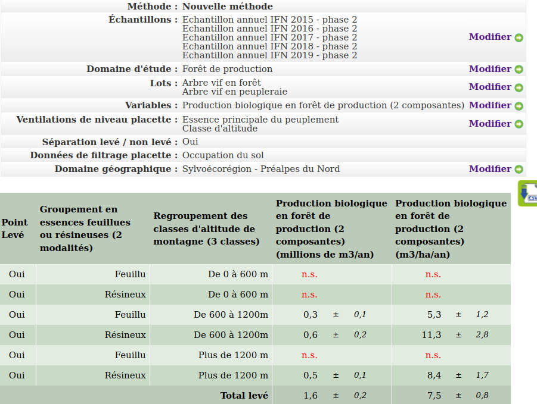
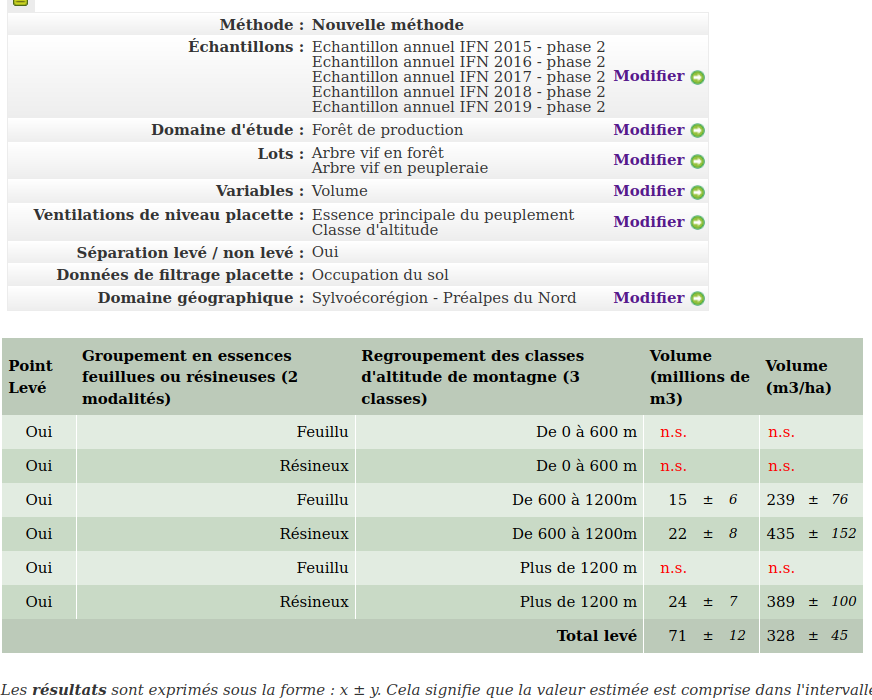

  
```{r setup, include=FALSE}
rm(list=setdiff(ls(), c("params")))
library(knitr)
knitr::opts_chunk$set(echo = TRUE, fig.width=12, fig.height=8)
# library(kableExtra)
#library(rgl)
#knit_hooks$set(webgl = hook_webgl)
options(scipen=999)
# wkhtmltopdf -B 15 -L 15 -R 15 -T 15 fiche-observatoire.html fiche-observatoire.pdf
# load packages
library(ggplot2)
library(plyr)
#
# set work directory
setwd("/home/jean-matthieu/R/PROTEST")# "/media/data/R/packages/PROTEST")#
```

---
# Introduction

L'objectif de ce document est de présenter les simulations d'évolution forestière réalisées par le logiciel SIMMEM sur le territoire du PNR du Massif des Bauges. 

```{r charge.donnees.initiales, echo=FALSE, warning=FALSE, message=FALSE}
l.forestStands <- list()
liste.scenario <- c("ADA", "TRE", "DYN", "PTR", "SCT")
for (i in liste.scenario)
{
  # load full file
  forestStands <- read.table(paste0("./output/forestStandsFULL", i,".txt"), header=TRUE, sep = '\t', stringsAsFactors = TRUE)
  forestStands$`WKT-GEOM` <- as.character(forestStands$`WKT.GEOM`)
  forestStands <- sf::st_sf(forestStands[,-which(names(forestStands)=="WKT-GEOM")], geom=sf::st_as_sfc(forestStands$`WKT-GEOM`))
  sf::st_crs(forestStands) <- 2154
  levels(forestStands$DOMAINE_TYPE) <- ifelse(levels(forestStands$DOMAINE_TYPE)=="Priv", "Privé", "Public")
  levels(forestStands$gestion) <- gsub("AccGere", "Accessible géré", levels(forestStands$gestion))
  levels(forestStands$gestion) <- gsub("AccNonGere", "Accessible non géré", levels(forestStands$gestion))
  levels(forestStands$gestion) <- gsub("NonAcc", "Non accessible", levels(forestStands$gestion))
  levels(forestStands$gestion) <- gsub("NonBuch", "Non bûcheronnable", levels(forestStands$gestion))
  forestStands$Itinéraire <- factor(ifelse(substr(forestStands$COMMENT,1,2)=="Co", "Inaction",
                                           ifelse(substr(forestStands$COMMENT,1,2)=="Ir", "Irrégulier",
                                                  ifelse(substr(forestStands$COMMENT,1,2)=="Th", "Amélioration","Coupe rase"))))
  forestStands$Essence <- forestStands$typologie
  levels(forestStands$Essence) <- gsub("Priv_", "", levels(forestStands$Essence))
  levels(forestStands$Essence) <- gsub("Pub_", "", levels(forestStands$Essence))
  names(forestStands) <- gsub("DOMAINE_TYPE", "Propriété", names(forestStands))
  names(forestStands) <- gsub("gestion", "Gestion", names(forestStands))
  l.forestStands[[i]] <- forestStands
}
```

Le nombre de polygones simulés est de `r nrow(forestStands)`, pour une surface totale de `r round(sum(forestStands$AREA)/10000,-1)` ha. 

```{r charger.simus, echo=FALSE, warning=FALSE, message=FALSE}
# simulation parameters
# 
duration <- 30
# time step = 3 yrs
timeStep <- 3
#
# load SIMMEM output file
l.df <- list()
for (i in liste.scenario)
{
  df <- read.csv(file=paste0("./simmem/simmemOutput/exportAuto", i, ".txt"), sep = "\t", skip = 3)
  #
  ###########################
  # mise en forme
  colnames(df)[1] <- "standId"
  # create columns for sp2
  # df$realSpecies2 <- -1
  # df$Ddom2 <- -1
  # #
  # # separate sp1 and sp2 data
  # df[df$realSpecies == 'Fagus sylvatica;Picea abies', 'realSpecies2'] <- 'Picea abies'
  # df[df$realSpecies == 'Fagus sylvatica;Abies alba', 'realSpecies2'] <- 'Abies alba'
  # df[df$realSpecies == 'Abies alba;Picea abies', 'realSpecies2'] <- 'Picea abies'
  # #
  # colnames(df)[colnames(df) == "realSpecies"] <- "realSpecies1"
  # df[df$realSpecies1 == 'Fagus sylvatica;Picea abies', 'realSpecies1'] <- 'Fagus sylvatica'
  # df[df$realSpecies1 == 'Fagus sylvatica;Abies alba', 'realSpecies1'] <- 'Fagus sylvatica'
  # df[df$realSpecies1 == 'Abies alba;Picea abies', 'realSpecies1'] <- 'Abies alba'
  # #
  # # TODO: separate Ddom1 and Ddom2
  # #
  # # retrieve area
  df <- merge(df, sf::st_drop_geometry(l.forestStands[[i]][,c("STAND_ID", "AREA", "Itinéraire", "Essence")]), by.x = "standId", by.y = "STAND_ID")
  # # managType
  # df$managType <- substr(df$comment, 1, 3)
  # # compo
  # df$compo <- substr(df$comment, 4, 6)
  # # owner
  # df$owner <- substr(df$comment, 7, 8)
  # order by standId and then by date
  df <- df[order(df$standId, df$date), ]
  #
  ##########################
  # remove repeated clearcut
  if(1)
  {
    # order df by standid then date
    df <- df[order(df$standId, df$date),]
    testStand <- df$standId[1:(nrow(df)-1)]==df$standId[2:nrow(df)]
    testYear <- df$date[1:(nrow(df)-1)]==df$date[2:nrow(df)]-3
    testVolume <- df$volumeRemoved_m3[1:(nrow(df)-1)]==df$volumeRemoved_m3[2:nrow(df)]
    testVolumeZero <- df$volumeRemoved_m3[-nrow(df)]!=0
    # testManagTyp <- df$managType[-nrow(df)]=="Har"
    # testBasalArea <- df$basalArea_m2[1:(nrow(df)-1)]>=df$basalArea_m2[2:nrow(df)]
    falseVolume <- which(testStand & testVolume & testVolumeZero & testYear)
    df$volumeRemoved_m3[falseVolume+1] <- 0
    #
  }
  #
  # keep only 30 years
  df <- df[df$date<=min(df$date)+duration,]
  #
  # récolte par periode
  # FAIT PLUS LOIN DANS LE SCRIPT
  # multiply volume * area
  # df$VolumeRemoved_m3 <- df$volumeRemoved_m3 * (df$AREA / 10000)
  # surface traitée annuellement
  # df$annualAREA <- (df$AREA / 10000) / timeStep
  # df[df$annualVolumeRemoved_m3 == 0, "annualAREA"] <- 0
  #
  l.df[[i]] <- df
}
names(l.forestStands) <- names(l.df) <- liste.scenario <- c("ADA", "TRE", "DYN", "PTR", "SCT")
```

On s'intéresse à une durée simulée de `r duration` années, avec une période simulée de `r timeStep` ans.

Dans le cas de la coupe rase, SIMMEM répète à chaque intervalle les valeurs du dernier volume exploité dans le fichier de sortie. Les valeurs en doublon sont enlevées du tableau de résultats. 

Dans le fichier de sortie de SIMEMM, une ligne par année est indiquée. La première année reprend les valeurs initiales. Une intervention est éventuellement déclenchée dès la première année. Ce sont donc les caractéristiques du peuplement avant intervention qui sont indiquées. Les caractéristiques du peuplement juste après intervention ne sont pas disponibles, la ligne suivante présentant les caractéristiques du peuplement après intervention éventuelle et croissance du peuplement pendant la période de simulation suivante. Aucune exploitation n'est donc réalisée lors de la dernière année de simulation.

```{r calcul.stats.globales, echo=FALSE, warning=FALSE, message=FALSE}
for (i in names(l.df))
{
  df <- l.df[[i]]
  forestStands <- l.forestStands[[i]]
  # initial G
  dummy <- df[df$date==2016, c("standId", "basalArea_m2")]
  names(dummy) <- c("STAND_ID", "G.init.m2.ha")
  forestStands <- merge(forestStands, dummy)
  # final G
  dummy <- df[df$date==(2016 + duration), c("standId", "basalArea_m2")]
  names(dummy) <- c("STAND_ID", "G.final.m2.ha")
  forestStands <- merge(forestStands, dummy)
  # initial Dg
  dummy <- df[df$date==(2016), c("standId", "Dg_cm")]
  names(dummy) <- c("STAND_ID", "Dg.init.m2.ha")
  forestStands <- merge(forestStands, dummy)
  # final Dg
  dummy <- df[df$date==(2016 + duration), c("standId", "Dg_cm")]
  names(dummy) <- c("STAND_ID", "Dg.final.m2.ha")
  forestStands <- merge(forestStands, dummy)
  # total volume harvested
  dummy <- aggregate(volumeRemoved_m3 ~ standId, data = df, FUN = sum)
  names(dummy) <- c("STAND_ID", "totalVolumeRemoved_m3.ha")
  forestStands <- merge(forestStands, dummy)
  # number of interventions
  dummy <- aggregate(volumeRemoved_m3 ~ standId, data = df, FUN = function(x) sum(x>0))
  names(dummy) <- c("STAND_ID", "nb.Interventions")
  forestStands <- merge(forestStands, dummy)
  #
  forestStands$totalVolumeRemoved_m3 <- forestStands$totalVolumeRemoved_m3.ha * forestStands$AREA / 10000
  #
  l.df[[i]] <- df
  l.forestStands[[i]] <- forestStands
}
```


# Volumes coupés et surface traitée

Le simulateur comptabilise le volume (volume sur écorce du tronc jusqu'à la découpe 7 cm) des arbres coupés. Les nombres présentés comprennent donc les volumes débardés plus les pertes d'exploitation. On entend par surface traitée la superficie des polygones où a eu lieu une intervention sylvicole de coupe (éclaircie, coupe finale ou rase, coupe en irrégulier).

## Aperçu général

Les surfaces traitées et volumes coupés annuellement sont présentés sur le graphique ci-dessous, le scénario "Patrimonialisation" (PTR) représentant la base 100. Par rapport aux volumes et surfaces annoncés pour les scénarios, les résultats de simulation sont moins contrastés. Les augmentations pressenties étaient :

* `r round(100/60*100)-100` % en volume et `r round(650/600*100)-100` % en surface pour "Adaptation forcée" (ADA),
* `r round(100/60*100)-100` % en volume et `r round(600/600*100)-100` % en surface pour "Transition énergétique" (TRE),
* `r round(85/60*100)-100` % en volume et `r round(650/600*100)-100` % en surface pour "Redynamisation forestière" (DYN),
* `r round(40/60*100)-100` % en volume et `r round(400/600*100)-100` % en surface pour "Sanctuarisation" (SCT).

Il paraît difficile de décorréler les volumes et surfaces, sauf à introduire des modifications plus importantes sur la sylviculture, notamment les diamètres objectifs et les régimes d'éclaircie.

```{r recolte.annuelle, echo=FALSE, warning=FALSE, message=FALSE, fig.width = 8, fig.height = 4}
par(mfrow = c(1,2))
#tab.recolte.m3.an <- sapply(l.forestStands, FUN = function(x){list(surface.ha.an = round(sum(x$AREA * x$nb.Interventions)/10000/30, -1), recolte.m3.an = round(sum(x$totalVolumeRemoved_m3)/30, -3))})
t.recolte.m3.an <- sapply(l.forestStands, FUN = function(x){sum(x$totalVolumeRemoved_m3)/duration})
dummy <- t.recolte.m3.an/t.recolte.m3.an["PTR"]*100
my_bar <- barplot(dummy, main = "Volume total coupé", ylab = "base 100 = scénario PTR")
text(my_bar, dummy-5 , paste0(ifelse(dummy >= 100, "+", ""), round(dummy/dummy["PTR"]*100-100)), cex=1)
abline(h=100, lty = 2)
#
t.surface.ha.an <- sapply(l.forestStands, FUN = function(x){sum(x$AREA * x$nb.Interventions)/10000/duration})
dummy <- t.surface.ha.an/t.surface.ha.an["PTR"]*100
my_bar <- barplot(dummy, main = "Surface annuelle traitée", ylab = "base 100 = scénario PTR")
text(my_bar, dummy-5 , paste0(ifelse(dummy >= 100, "+", ""), round(dummy/dummy["PTR"]*100-100)), cex=1)
abline(h=100, lty = 2)
```

Les tableaux ci-dessous montrent la surface gérée, la surface traitée en moyenne annuelle, le volume total coupé en moyenne annuelle, et la volume coupé moyen en m^3^ par an et par hectare de forêt gérée. Le premier présente les chiffres en valeur absolue, le second en relatif (pourcentage) par rapport au scénario "PTR".

```{r donnees, echo=FALSE, warning=FALSE, message=FALSE, fig.height = 5}
tab.SurfaceTraitee <- lapply(l.forestStands, function(x){aggregate(AREA*nb.Interventions/(duration*10000) ~ Essence + Itinéraire + Propriété, data = x, FUN = function(x){sum(x, na.rm = TRUE)})})
tab.SurfaceTraitee <- mapply(function(x, y){x$Scénario <- y;return(x)}, tab.SurfaceTraitee, as.list(liste.scenario), SIMPLIFY = FALSE)
tab.SurfaceTraitee <- do.call(rbind, tab.SurfaceTraitee)
tab.SurfaceTraitee$Itinéraire <- factor(tab.SurfaceTraitee$Itinéraire, levels = c("Inaction", "Coupe rase", "Amélioration", "Irrégulier"))
tab.SurfaceTraitee$Scénario <- factor(tab.SurfaceTraitee$Scénario, levels = liste.scenario)
names(tab.SurfaceTraitee)[ncol(tab.SurfaceTraitee)-1] <- "Surface.traitee_ha.an"
#
tab.SurfaceGeree <- lapply(l.forestStands, function(x){aggregate(AREA/10000 ~ Essence + Itinéraire + Propriété, data = x, FUN = function(x){sum(x, na.rm = TRUE)})})
tab.SurfaceGeree <- mapply(function(x, y){x$Scénario <- y;return(x)}, tab.SurfaceGeree, as.list(liste.scenario), SIMPLIFY = FALSE)
tab.SurfaceGeree <- do.call(rbind, tab.SurfaceGeree)
tab.SurfaceGeree$Itinéraire <- factor(tab.SurfaceGeree$Itinéraire, levels = c("Inaction", "Coupe rase", "Amélioration", "Irrégulier"))
tab.SurfaceGeree$Scénario <- factor(tab.SurfaceGeree$Scénario, levels = liste.scenario)
names(tab.SurfaceGeree)[ncol(tab.SurfaceGeree)-1] <- "Surface.geree_ha"
#
tab.VolumeRemoved <- lapply(l.forestStands, function(x){aggregate(totalVolumeRemoved_m3/duration ~ Essence + Itinéraire + Propriété, data = x, FUN = function(x){sum(x, na.rm = TRUE)})})
tab.VolumeRemoved <- mapply(function(x, y){x$Scénario <- y;return(x)}, tab.VolumeRemoved, as.list(liste.scenario), SIMPLIFY = FALSE)
tab.VolumeRemoved <- do.call(rbind, tab.VolumeRemoved)
tab.VolumeRemoved$Itinéraire <- factor(tab.VolumeRemoved$Itinéraire, levels = c("Inaction", "Coupe rase", "Amélioration", "Irrégulier"))
tab.VolumeRemoved$Scénario <- factor(tab.VolumeRemoved$Scénario, levels = liste.scenario)
names(tab.VolumeRemoved)[ncol(tab.VolumeRemoved) -1] <- "totalVolumeRemoved_m3.an"

dummy <- l.forestStands
tab.G.final.m2 <- lapply(dummy, function(x){aggregate(G.final.m2.ha*AREA/10000 ~ Essence + Itinéraire + Propriété, data = x, FUN = function(x){sum(x, na.rm = TRUE)})})
tab.G.final.m2 <- mapply(function(x, y){x$Scénario <- y;return(x)}, tab.G.final.m2, as.list(liste.scenario), SIMPLIFY = FALSE)
tab.G.final.m2 <- do.call(rbind, tab.G.final.m2)
tab.G.final.m2$Itinéraire <- factor(tab.G.final.m2$Itinéraire, levels = c("Inaction", "Coupe rase", "Amélioration", "Irrégulier"))
tab.G.final.m2$Scénario <- factor(tab.G.final.m2$Scénario, levels = liste.scenario)
names(tab.G.final.m2)[ncol(tab.G.final.m2) -1] <- "G.m2"
tab.G.final.m2$Year <- "2046"
#
tab.G.init.m2 <- lapply(dummy, function(x){aggregate(G.init.m2.ha*AREA/10000 ~ Essence + Itinéraire + Propriété, data = x, FUN = function(x){sum(x, na.rm = TRUE)})})
tab.G.init.m2 <- mapply(function(x, y){x$Scénario <- y;return(x)}, tab.G.init.m2, as.list(liste.scenario), SIMPLIFY = FALSE)
tab.G.init.m2 <- do.call(rbind, tab.G.init.m2)
tab.G.init.m2$Itinéraire <- factor(tab.G.init.m2$Itinéraire, levels = c("Inaction", "Coupe rase", "Amélioration", "Irrégulier"))
tab.G.init.m2$Scénario <- factor(tab.G.init.m2$Scénario, levels = liste.scenario)
names(tab.G.init.m2)[ncol(tab.G.init.m2) -1] <- "G.m2"
tab.G.init.m2$Year <- "2016"
#
tab.G.m2 <- rbind(tab.G.final.m2, tab.G.init.m2)
rm(tab.G.init.m2, tab.G.final.m2)
#
recap <- aggregate(Surface.geree_ha ~ Scénario, data = tab.SurfaceGeree[tab.SurfaceGeree$Itinéraire!="Inaction",], FUN = sum)
dummy <- aggregate(totalVolumeRemoved_m3.an ~ Scénario, data = tab.VolumeRemoved, FUN = sum)
recap <- merge(recap, dummy)
dummy <- aggregate(Surface.traitee_ha.an ~ Scénario, data = tab.SurfaceTraitee, FUN = sum)
recap <- merge(recap, dummy)
row.names(recap) <- recap$Scénario
recap <- recap[liste.scenario,]
recap$Recolte.m3.ha.an <- recap$totalVolumeRemoved_m3.an / recap$Surface.geree_ha
recap <- recap[, c(1, 2, 4, 5, 3)]
names(recap) <- c("Scénario", "Surface gérée (ha)", "Surface traitée (ha/an)", "Volume coupé moyen (m3/ha/an)", "Volume coupé total (m3/an)")
recap.relatif <- recap
recap[, "Surface gérée (ha)"] <- round(recap[, "Surface gérée (ha)"], -2)
recap[, "Surface traitée (ha/an)"] <- round(recap[, "Surface traitée (ha/an)"], -1)
recap[, "Volume coupé moyen (m3/ha/an)"] <- round(recap[, "Volume coupé moyen (m3/ha/an)"], 1)
recap[, "Volume coupé total (m3/an)(m3/an)"] <- round(recap[, "Volume coupé total (m3/an)"], -3)
knitr::kable(recap, row.names = FALSE)
#
recap.relatif[,2:5] <- apply(recap.relatif[,2:5], 2, FUN = function(x) {round((x / x[4]-1)*100, 0)})
convert.percent <- function(x) {ifelse(x>0, paste0("+", x, " %"), paste0(x, " %"))}
recap.relatif[,2:5] <- lapply(recap.relatif[,2:5], convert.percent)
knitr::kable(recap.relatif[-4,], row.names = FALSE)
```
À titre de comparaison, l'IFN calcule un accroissement de 11,5 m^3^/ha/an pour la forêt de production pour les peuplements résineux d'altitude 600 à 1200 m de la sylvoécorégion "Préalpes du Nord". Il est de 7,5 m^3^/ha/an pour l'ensemble des forêts de la sylvoécorégion.


## Carte des volumes coupés

La répartition des volumes coupés sur le territoire est présentée sur la carte suivante. Les zones en gris sont les polygones en inaction.

```{r carte.intensite, echo=FALSE, warning=FALSE, message=FALSE, fig.height = 9, fig.width = 12}
# bind
dummy <- mapply(function(x, y){x$Scénario <- y;return(x)}, l.forestStands, as.list(liste.scenario))
dummy <- lapply(dummy, function(x){x[,c("Scénario", "Itinéraire", "totalVolumeRemoved_m3.ha")]})
dummy <- do.call(rbind, dummy)
dummy$totalVolumeRemoved_m3.ha[dummy$Itinéraire=="Inaction"] <- NA
col.pal <- colorRampPalette(c("#00007F", "blue", "#007FFF", "cyan", "#7FFF7F", "yellow", "#FF7F00", "red", "#7F0000"))
fill.colors <- col.pal(64)
#qn <- scales::rescale(quantile(test$totalVolumeRemoved_m3.ha, probs=seq(0, 1, length.out=length(fill.colors)), na.rm = TRUE))
g <- ggplot() + geom_sf(data=dummy, aes(fill=totalVolumeRemoved_m3.ha), color = NA) + theme(legend.position="bottom") +
  #scale_fill_gradientn(colours=fill.colors, values = qn) +
  scale_fill_gradientn(colours=fill.colors)+#, trans = "log10") +
  # scale_fill_gradientn(colours=fill.colors, trans = 'norm', breaks = quantile(dummy$totalVolumeRemoved_m3.ha, probs=seq(0, 1, length.out=length(fill.colors)), na.rm = TRUE)) +
  facet_wrap(Scénario ~ .) +
  theme(
    panel.border = element_blank(),
    axis.text = element_blank(),
    panel.grid = element_blank(),
    axis.ticks = element_blank()#,
  ) +
  labs(fill = paste0("Volumes coupés sur ", duration, " ans (m3/ha)"))
print(g)
```

```{r fonction.cumule.width, echo=FALSE, warning=FALSE, message=FALSE}
prepare.data <- function(var, fac1, fac2, espace = TRUE, fac.names = c("x", "y"))
{
  
  # tableau de contingence pondere
  dummy <- questionr::wtd.table(x=fac1, y=fac2, weights = var)
  #
  # somme par ligne
  dummy.sum <- apply(dummy, 1, sum)
  # convertir en df
  dummy.sum <- data.frame(dummy.sum)
  # calculer les centres des barres
  dummy.sum$xcenter <- cumsum(dummy.sum$dummy.sum) - 0.5 * dummy.sum$dummy.sum + espace * sum(dummy.sum$dummy.sum)/ 50 * (1:nrow(dummy.sum)-1)
  #
  # convertir le tableau de contingence en proportion par ligne
  dummy <- dummy/dummy.sum$dummy.sum
  # inverser les colonnes
  dummy <- dummy[, rev(1:ncol(dummy))]
  # calculer la somme cumulee
  dummy <- t(apply(dummy, 1, cumsum))
  # convertir en df
  dummy <- as.data.frame.matrix(dummy)
  # ajouter la colonne scenario
  dummy$x <- row.names(dummy)
  # convertir du format wide au long
  dummy <- reshape(dummy, direction="long",varying = list(names(dummy)[1:(ncol(dummy)-1)]), idvar = "x", timevar="y", times = names(dummy)[1:(ncol(dummy)-1)], v.names="CumProportion")
  # mettre dans l'ordre avant calcul proportion
  dummy <- dummy[order(match(dummy$y, rev(levels(fac2)))),]
  dummy <- dummy[order(dummy$x),]
  # dummy <- dummy[order(dummy$x, dummy$y, decreasing = c(FALSE, TRUE), method = "radix"),]
  # calcul proportion par difference
  dummy$Proportion <- NA
  dummy$Proportion[2:nrow(dummy)] <- ifelse(dummy$x[1:(nrow(dummy)-1)] == dummy$x[2:(nrow(dummy))], dummy$CumProportion[2:(nrow(dummy))] - dummy$CumProportion[1:(nrow(dummy)-1)], NA)
  dummy$Proportion[is.na(dummy$Proportion)] <- dummy$CumProportion[is.na(dummy$Proportion)]
  #
  # ajouter le centre de la barre
  dummy$xcenter <- dummy.sum[dummy$x, "xcenter"]
  # ajouter la largeur de la barre
  dummy$xwidth <- dummy.sum[dummy$x, "dummy.sum"]
  names(dummy)[1:2] <- fac.names
  list(dummy, dummy.sum)
}
```

## Par propriété

Concernant la répartition des volumes coupés par type de propriété, les différences avec les scénarios sont importantes :

* ADA prévoyait +50% en forêt publique et +100% en forêt privée,
* TRE prévoyait environ +10% en public et presque +175% en privé,
* DYN +125% en privé,
* SCT -25% en public et -50% en privé.

Il apparaît déjà que le scénario de référence table sur un volume récolté deux fois supérieur en public qu'en privé, alors que les simulations donnent un volume coupé près de 1,5 fois supérieur en privé.

Dans les simulations, ADA comporte une augmentation en privé et public. Pour les scénarios TRE et DYN, l'augmentation est réalisée majoritairement en privé. La répartition des volumes coupés change peu avec le scénario SCT.

```{r recolte.propriete, echo=FALSE, warning=FALSE, message=FALSE, fig.height = 3.5, fig.width = 9}
g1 <- ggplot(data = tab.VolumeRemoved, aes(x=Scénario, y=totalVolumeRemoved_m3.an, fill=Propriété)) +
  geom_bar(stat="identity") +
  scale_fill_manual(breaks = c("Privé", "Public") , values=c("green", "blue")) +
  # facet_wrap(scenario ~ ., nrow = 1) +
  theme(legend.position="none",
        axis.text.x = element_text(angle = 0)) +
  labs(y="Volumes coupés (m3/an)")
#
dummy <- prepare.data(tab.VolumeRemoved$totalVolumeRemoved_m3.an, tab.VolumeRemoved$Scénario, tab.VolumeRemoved$Propriété, espace = TRUE, fac.names = c("Scénario", "Propriété"))
#
g3 <- ggplot(data = dummy[[1]], aes(x=xcenter, y=CumProportion - 0.5 * Proportion, fill=Propriété)) +
  geom_tile(aes(width=xwidth, height=Proportion)) +
  scale_x_continuous(breaks=dummy[[2]]$xcenter, labels=row.names(dummy[[2]])) +
  # geom_text(aes(label = Essence)) +
  scale_fill_manual(breaks = c("Privé", "Public") , values=c("green", "blue")) +
  # facet_wrap(Scénario ~ ., nrow = 1) +
  theme(legend.position="none",
        axis.text.x = element_text(angle = 0)) +
  labs(y="Volumes coupés (proportion)", x="Scénario")
#
g2 <- ggplot(data = tab.SurfaceTraitee, aes(x=Scénario, y=Surface.traitee_ha.an, fill=Propriété)) +
  geom_bar(stat="identity") +
  scale_fill_manual(breaks = c("Privé", "Public") , values=c("green", "blue")) +
  # facet_wrap(scenario ~ ., nrow = 1) +
  theme(legend.position="none",
        axis.text.x = element_text(angle = 0)) +
  labs(y="Surface traitée (ha/an)")
#
cowplot::plot_grid(g1, g3, g2, cowplot::get_legend(g1 + theme(legend.position="right")), nrow = 1, rel_widths = c(5, 5, 5, 1.5))
```

## Par essence

Là encore les scénarios restent peu contrastés:

* ADA a une proportion plus importante de volumes coupés en mixte, et très légèrement en sapin-épicéa.
* TRE et dans une moindre mesure DYN ont des volumes coupés un peu plus importants en feuillus.
* SCT a une proportion plus importante en "Autres feuillus".

```{r recolte.essence, echo=FALSE, warning=FALSE, message=FALSE, fig.height = 3.5, fig.width = 12}
dummy <- prepare.data(tab.VolumeRemoved$totalVolumeRemoved_m3.an, tab.VolumeRemoved$Scénario, tab.VolumeRemoved$Essence, espace = TRUE, fac.names = c("Scénario", "Essence"))
#
g3 <- ggplot(data = dummy[[1]], aes(x=xcenter, y=CumProportion - 0.5 * Proportion, fill=Essence)) +
  geom_tile(aes(width=xwidth, height=Proportion)) +
  scale_x_continuous(breaks=dummy[[2]]$xcenter, labels=row.names(dummy[[2]])) +
  # geom_text(aes(label = Essence)) +
  #scale_fill_manual(breaks = c("Privé", "Public") , values=c("green", "blue")) +
  # facet_wrap(Scénario ~ ., nrow = 1) +
  theme(legend.position="none",
        axis.text.x = element_text(angle = 0)) +
  labs(y="Volumes coupés (proportion)", x="Scénario")
#
g1 <- ggplot(data = tab.VolumeRemoved, aes(x=Scénario, y=totalVolumeRemoved_m3.an, fill=Essence)) +
  geom_bar(stat="identity") +
  #scale_fill_manual(breaks = c("Privé", "Public") , values=c("green", "blue")) +
  # facet_wrap(scenario ~ ., nrow = 1) +
  theme(legend.position="none",
        axis.text.x = element_text(angle = 0)) +
  labs(y="Volumes coupés (m3/an)")
#
g2 <- ggplot(data = tab.SurfaceTraitee, aes(x=Scénario, y=Surface.traitee_ha.an, fill=Essence)) +
  geom_bar(stat="identity") +
  #scale_fill_manual(breaks = c("Privé", "Public") , values=c("green", "blue")) +
  # facet_wrap(scenario ~ ., nrow = 1) +
  theme(legend.position="none",
        axis.text.x = element_text(angle = 0)) +
  labs(y="Surface traitée (ha/an)")
#
cowplot::plot_grid(g1, g3, g2, cowplot::get_legend(g1 + theme(legend.position="right")), ncol = 4, rel_widths = c(5, 5, 5, 2))
```

## Par essence et propriété

En public, les volumes coupés sont majoritairement en sapin-épicéa, et en mixte. Il y a moins de peuplements feuillus qu'en privé.

```{r recolte.essence.propriete, echo=FALSE, warning=FALSE, message=FALSE, fig.height = 3.5, fig.width = 7}
g <- ggplot(data = tab.VolumeRemoved, aes(x=Propriété, y=totalVolumeRemoved_m3.an, fill=Essence)) +
  geom_bar(stat="identity") +
  # scale_fill_manual(breaks = c("Privé", "Public") , values=c("green", "blue")) +
  facet_wrap(Scénario ~ ., nrow = 1) +
  theme(legend.position="right",
        axis.text.x = element_text(angle = 0)) +
  labs(y="Volumes coupés (m3/an)")
print(g)
```

## Par itinéraire

ADA est caractérisé par une augmentation de la proportion de coupe rase (surtout en privé) et d'amélioration (surtout en public) par rapport aux autres scénarios. SCT a une proportion plus importante d'irrégulier.

```{r recolte.itineraire, echo=FALSE, warning=FALSE, message=FALSE, fig.height = 3.5, fig.width = 12}
dummy <- tab.VolumeRemoved[tab.VolumeRemoved$Itinéraire != "Inaction",]
dummy <- prepare.data(tab.VolumeRemoved$totalVolumeRemoved_m3.an, tab.VolumeRemoved$Scénario, tab.VolumeRemoved$Itinéraire, espace = TRUE, fac.names = c("Scénario", "Itinéraire"))
#
g3 <- ggplot(data = dummy[[1]], aes(x=xcenter, y=CumProportion - 0.5 * Proportion, fill=Itinéraire)) +
  geom_tile(aes(width=xwidth, height=Proportion)) +
  scale_x_continuous(breaks=dummy[[2]]$xcenter, labels=row.names(dummy[[2]])) +
  # geom_text(aes(label = Essence)) +
  scale_fill_manual(breaks = c("Inaction", "Coupe rase", "Amélioration", "Irrégulier") , values=c("grey", "red", "orange", "yellow")) +
  # facet_wrap(Scénario ~ ., nrow = 1) +
  theme(legend.position="none",
        axis.text.x = element_text(angle = 0)) +
  labs(y="Volumes coupés (proportion)", x="Scénario")

g1 <- ggplot(data = tab.VolumeRemoved, aes(x=Scénario, y=totalVolumeRemoved_m3.an, fill=Itinéraire)) +
  geom_bar(stat="identity") +
  scale_fill_manual(breaks = c("Inaction", "Coupe rase", "Amélioration", "Irrégulier") , values=c("grey", "red", "orange", "yellow")) +
  # facet_wrap(scenario ~ ., nrow = 1) +
  theme(legend.position="none",
        axis.text.x = element_text(angle = 0)) +
  labs(y="Volumes coupés (m3/an)")
#
g2 <- ggplot(data = tab.SurfaceTraitee, aes(x=Scénario, y=Surface.traitee_ha.an, fill=Itinéraire)) +
  geom_bar(stat="identity") +
  scale_fill_manual(breaks = c("Inaction", "Coupe rase", "Amélioration", "Irrégulier") , values=c("grey", "red", "orange", "yellow")) +
  # facet_wrap(scenario ~ ., nrow = 1) +
  theme(legend.position="none",
        axis.text.x = element_text(angle = 0)) +
  labs(y="Surface traitée (ha/an)")
#
cowplot::plot_grid(g1, g3, g2, cowplot::get_legend(g1 + theme(legend.position="right")), ncol = 4, rel_widths = c(5, 5, 5, 2))
```

La répartition des volumes coupés par itinéraire, essence et propriété est présentée ci-dessous.

```{r recolte.iti.essence.propriete, echo=FALSE, warning=FALSE, message=FALSE, fig.height = 5}
g <- ggplot(data = tab.VolumeRemoved, aes(x=Scénario, y=totalVolumeRemoved_m3.an, fill=Itinéraire)) +
  geom_bar(stat="identity") +
  scale_fill_manual(breaks = c("Inaction", "Coupe rase", "Amélioration", "Irrégulier") , values=c("grey", "red", "orange", "yellow")) +
  facet_grid(Propriété ~ Essence) +
  theme(legend.position="right",
        axis.text.x = element_text(angle = 0)) +
  labs(y="Volumes coupés (m3/an)")
print(g)
```

# Interventions sylvicoles

## Nombre

Les cartes ci-dessous montrent le nombre d'interventions sur la période (éclaircie ou coupe). Il n'y a pas de différence flagrante entre les scénarios.

```{r carte.intervention, echo=FALSE, warning=FALSE, message=FALSE, fig.height = 9, fig.width = 12}
dummy <- lapply(l.forestStands, function(x){
  x$Intervention <- x$nb.Interventions
  x$Intervention[x$Itinéraire=="Inaction"] <- -1
  x$Intervention[x$Intervention>3] <- 3
  x$Intervention <- factor(as.character(x$Intervention), levels = c(-1, 0, 1, 2, 3))
  levels(x$Intervention) <- c("Inaction", "0", "1", "2", "3 et plus")
  g <- ggplot() + geom_sf(data=x["Intervention"], aes(fill=Intervention), color = NA) + theme(legend.position="none") +
    scale_fill_manual(breaks = levels(x$Intervention) , values=c("grey", "red", "orange", "yellow", "green", "blue")) +
    theme(
      panel.border = element_blank(),
      axis.text = element_blank(),
      panel.grid = element_blank(),
      axis.ticks = element_blank()#,
    )
})

prow <- cowplot::plot_grid(plotlist = dummy,
           align = 'vh',
           labels = liste.scenario,
           hjust = -1,
           nrow = 2
           )
legend_b <- cowplot::get_legend(dummy[[1]] + theme(legend.position="bottom"))

# add the legend underneath the row we made earlier. Give it 10% of the height
# of one plot (via rel_heights).
p <- cowplot::plot_grid(prow, legend_b, ncol = 1, rel_heights = c(8, 1))
print(p)
# legend("topright", c("Accessible <2km", "Accessible >2km", "Non accessible", "Non bûcheronnable"), fill=c("green", "yellow", "pink", "purple"))
# plot(f
```

Le nombre moyen d'interventions pour les polygones gérés varie très peu.

```{r stats.intervention, echo=FALSE, warning=FALSE, message=FALSE, fig.height = 3, fig.width = 12}
dummy <- mapply(function(x, y){
  x$Scénario <- y
  x$Intervention <- x$nb.Interventions
  x$Intervention[x$Itinéraire=="Inaction"] <- -1
  x$Intervention <- factor(as.character(x$Intervention), levels = sort(unique(x$Intervention)))
  levels(x$Intervention) <- gsub("-1", "Inaction", levels(x$Intervention))
  x
  }, l.forestStands, liste.scenario)

stats <- sapply(dummy, function(x){
  x$Intervention[x$Intervention == "Inaction"] <- NA
  x$Intervention <- as.numeric(x$Intervention)
  sum(x$Intervention * x$AREA, na.rm = TRUE)/sum(x$AREA)
})
knitr::kable(round(stats, 2))
```
Les graphiques suivants présentent la distribution du nombre d'interventions par polygone.

```{r histo.intervention, echo=FALSE, warning=FALSE, message=FALSE, fig.height = 3, fig.width = 12}
test <- mapply(function(x, y){
  x <- aggregate(AREA/10000 ~ Intervention, data=x, FUN=sum)
names(x) <- c("Intervention", "Surface")
x$Scénario <- y
x},
dummy, 
liste.scenario,
SIMPLIFY = FALSE
)

test <- do.call(rbind, test)
test$Scénario <- factor(test$Scénario, levels = liste.scenario)
g <- ggplot() + geom_bar(data=test, aes(x=Intervention, weights = Surface, fill=Intervention)) + theme(legend.position="none") +
  scale_fill_manual(breaks = levels(test$Intervention) , values=c("grey", "red", "orange", "yellow", "green", "green", "green", "green")) + 
  facet_wrap(Scénario ~ ., nrow = 1) +
  labs(y="Surface (ha)", x = paste0("Nombre d'interventions sur ", duration, " ans"))
print(g)
```

## Intensité

La moyenne de l'intensité des interventions est environ de 170 m^3^/ha pour tous les scénarios.

```{r stats.intensite, echo=FALSE, warning=FALSE, message=FALSE, fig.height = 3, fig.width = 6}
dummy <- mapply(FUN = function(x, y){x$Scénario <-y; return(x)}, l.df, as.list(liste.scenario), SIMPLIFY = FALSE)
dummy <- do.call(rbind, dummy)
dummy$volumeRemoved_m3[dummy$volumeRemoved_m3==0] <- NA
dummy$Scénario <- factor(dummy$Scénario, levels = c("ADA", "TRE", "DYN", "PTR", "SCT"))

stats <- by(dummy[which(dummy$volumeRemoved_m3>0),], dummy$Scénario[which(dummy$volumeRemoved_m3>0)], function(x){sum(x$volumeRemoved_m3 * x$AREA, na.rm = TRUE)/sum(x$AREA, na.rm = TRUE)}, simplify = FALSE)
stats <- unlist(stats)

knitr::kable(round(stats))
```

À titre de comparaison, l'IFN calcule un volume moyen de 435 m^3^/ha pour la forêt de production pour les peuplements résineux d'altitude 600 à 1200 m de la sylvoécorégion "Préalpes du Nord". Il est de 328 m^3^/ha pour l'ensemble des forêts de la sylvoécorégion.


La répartition de la surface traitée par l'intensité des interventions reste peu changée, sauf pour le scénario ADA, qui comporte plus de coupe rase et d'amélioration. Ce scénario comporte donc à la fois plus de légères et plus de fortes coupes.

```{r distribution.intensite, echo=FALSE, warning=FALSE, message=FALSE, fig.height = 3, fig.width = 6}
g <- ggplot(data = dummy, aes(x=volumeRemoved_m3, weight = AREA, col=Scénario)) +
  geom_density() +
  theme(legend.position="right",
        axis.text.x = element_text(angle = 0)) +
  labs(y="Densité (en surface)", x="Intensité de l'intervention (m3/ha)")
print(g)
```

<!-- La répartition de chaque itinéraire pour l'intensité de coupe est présentée sur les graphiques ci-dessous. Les courbes changent peu. -->

```{r distribution.intensite.iti, eval = FALSE, echo=FALSE, warning=FALSE, message=FALSE, fig.height = 3.5, fig.width = 12}
g <- ggplot(data = dummy, aes(x=volumeRemoved_m3, weight = AREA, col=Itinéraire)) +
  geom_density() +
  scale_colour_manual(breaks = c("Coupe rase", "Amélioration", "Irrégulier") , values=c("red", "orange", "yellow")) +
  facet_wrap(Scénario ~ ., ncol = 5) +
  theme(legend.position="bottom",
        axis.text.x = element_text(angle = 0)) +
  labs(y="Densité (en surface)", x="Intensité de l'intervention (m3/ha)")
print(g)
```

La répartition des volumes coupés par intensité d'intervention est présentée ci-dessous.

```{r distribution.intensite.recolte, echo=FALSE, warning=FALSE, message=FALSE, fig.height = 3.5, fig.width = 12}

g <- ggplot(data = dummy, aes(x=volumeRemoved_m3, weight = volumeRemoved_m3*AREA/10000 , fill=Itinéraire)) +
  geom_histogram(stat="bin") +
  scale_fill_manual(breaks = c("Inaction", "Coupe rase", "Amélioration", "Irrégulier") , values=c("grey", "red", "orange", "yellow")) +
  facet_wrap(Scénario ~ ., ncol = 5) +
  theme(legend.position="bottom",
        axis.text.x = element_text(angle = 0)) +
  labs(y="Volumes coupés sur 30 ans", x="Intensité de l'intervention (m3/ha)")
print(g)
```

<!-- La distribution de l'intensité de l'intervention selon la propriété et l'essence est présentée ci-dessous. -->

```{r distribution.intensite.essence.propriete, eval = FALSE, echo=FALSE, warning=FALSE, message=FALSE, fig.height = 3.5, fig.width = 12}
g <- ggplot(data = dummy, aes(y=volumeRemoved_m3, x=Scénario, col = domainType)) +
  geom_violin(position = "dodge") +
  # scale_col_manual(breaks = c("Inaction", "Coupe rase", "Amélioration", "Irrégulier") , values=c("grey", "red", "orange", "yellow")) +
  facet_wrap(Essence ~ ., ncol = 5) +
  theme(legend.position="bottom",
        axis.text.x = element_text(angle = 0)) +
  labs(y="Volumes coupés (m3/ha)")
print(g)
```

# Surface terrière

## Par itinéraire

Exceptés les peuplements en inaction, on constate une légère décapitalisation pour tous les scénarios. Celle-ci est plus importante pour le scénario "ADA", et quasi inexistante pour "SCT". 

```{r g.itineraire, echo=FALSE, warning=FALSE, message=FALSE, fig.height = 3.5, fig.width = 6}
tab.G.m2$Scénario.Year <- paste0(tab.G.m2$Scénario, "", tab.G.m2$Year)
g1 <- ggplot(data = tab.G.m2, aes(x=Year, y=G.m2/1000000, fill=Itinéraire)) +
  geom_col() +
  scale_fill_manual(breaks = c("Inaction", "Coupe rase", "Amélioration", "Irrégulier") , values=c("grey", "red", "orange", "yellow")) +
  facet_wrap(Scénario ~ ., nrow = 1) +
  theme(legend.position="right",
        axis.text.x = element_text(angle = 45)) +
  labs(y="Surface terrière (Mm2)")
print(g1)
```

## Par essence

Pour "ADA", ce sont essentiellement les peuplements mixtes en forêt privée qui sont décapitalisés.

```{r g.essence, echo=FALSE, warning=FALSE, message=FALSE, fig.height = 3.5, fig.width = 6}
g1 <- ggplot(data = tab.G.m2[tab.G.m2$Itinéraire!="Inaction",], aes(x=Year, y=G.m2/1000000, fill=Essence)) +
  geom_bar(stat="identity") +
  #scale_fill_manual(breaks = c("Inaction", "Coupe rase", "Amélioration", "Irrégulier") , values=c("grey", "red", "orange", "yellow")) +
  facet_wrap(Scénario ~ ., nrow = 1) +
  theme(legend.position="right",
        axis.text.x = element_text(angle = 45)) +
  labs(y="Surface terrière en gestion (Mm2)")
print(g1)
```

## Par propriété

La surface terrière est légèrement croissante en forêt publique (sauf "ADA"), la diminution se faisant essentiellement en forêt privée.

```{r g.propriete, echo=FALSE, warning=FALSE, message=FALSE, fig.height = 3.5, fig.width = 6}
g1 <- ggplot(data = tab.G.m2[tab.G.m2$Itinéraire!="Inaction",], aes(x=Year, y=G.m2/1000000, fill=Propriété)) +
  geom_bar(stat="identity") +
  scale_fill_manual(breaks = c("Privé", "Public") , values=c("green", "blue")) +
  facet_wrap(Scénario ~ ., nrow = 1) +
  theme(legend.position="right",
        axis.text.x = element_text(angle = 45)) +
  labs(y="Surface terrière en gestion (Mm2)")
print(g1)
```

# Services écosystémiques

On constate de manière générale assez peu de différence entre les scénarios du point de vue des services écosystémiques calculés à partir des résultats de simulation.

```{r SE.functions, echo=FALSE, warning=FALSE, message=FALSE, fig.height = 3.5, fig.width = 6}
# modeles pour calcul Dmoyen
load(file="./data/modeleDistribution_03_09_61_62.ro")
Dg2Dm <- function(Dg, species)
{
  dm.AF <- sqrt(Dg^2 - (predict(modRichards_03, data.frame(Dg =Dg)))^2)
  dm.H <- sqrt(Dg^2 - (predict(modRichards_09, data.frame(Dg =Dg)))^2)
  dm.S <- sqrt(Dg^2 - (predict(modRichards_61, data.frame(Dg =Dg)))^2)
  dm.E <- sqrt(Dg^2 - (predict(modRichards_62, data.frame(Dg =Dg)))^2)
  ifelse(species=="Autres feuillus",
         dm.AF,
         ifelse(species == "Sapin-épicéa", # moyenne sapin et épicéa
                (dm.S+dm.E)/2,
                ifelse(species == "Mixte", # moyenne sapin et hêtre
                       (dm.S+dm.H)/2,
                       dm.H) # sinon hêtre
                )
         )
}
#
# avalanche
SE.avalanche.protection.index <- function(resineux.boolean, G.m2.ha, D.moy.cm, slope.degree, altitude.m)
{
  ifelse(slope.degree>=28 & slope.degree<55 & altitude.m >=800,
         pmin(ifelse(resineux.boolean,
                     G.m2.ha/((0.2901 * D.moy.cm + 1.494)*(0.1333 * slope.degree-3)),
                     G.m2.ha/((0.528 * D.moy.cm + 1.5566)*(0.1333 * slope.degree-3))), 1),
         NA)
}

# # regulation de l'érosion
load("./data/modeleTCL.rda")
library(nlme)
GDg2tauxCouvert <- function(G, Dg)
{
  exp(predict(mod_tcl_gnls.for, data.frame(GtotFinal = G, DgTotFinal = Dg)))/100
}
# # taux de couvert
# TC <- function(G, Dg) {exp(log(G^a)*(b + c * log(Dg)))}
# # C <- 0.0001 + 0.0029 * (1-TC)
# # perte en masse des sols
# A = erosion.R * erosion.K * erosion.LS * C * erosion.P
#
# foret de protection
SE.rockfall.protection1 <- function(L.m, D.moy.cm, G.m2.ha)
{
  slope.Lw <- ifelse(L.m <= 300, 0.0277 * L.m + 0, 0.0159 * L.m + 3.56)
  slope.Hg <- ifelse(L.m <= 300, 0.0062 * L.m + 0.18, 0.0084 * L.m - 0.48)
  intercept <- ifelse(L.m <= 300, -0.0127 * L.m + 5.15, -0.0066 * L.m + 3.32)
  ifelse(D.moy.cm > slope.Lw * G.m2.ha + intercept,
         "Faible",
         ifelse(D.moy.cm < slope.Hg * G.m2.ha + intercept,
                "Haute",
                "Intermédiaire"))
}
SE.rockfall.protection5 <- function(L.m, D.moy.cm, G.m2.ha)
{
  slope.Lw <- ifelse(L.m <= 300, 0.0309  * L.m + 0, 0.0086 * L.m + 6.68)
  slope.Hg <- ifelse(L.m <= 300, 0.0074 * L.m + 0, 0.0013 * L.m + 1.83)
  intercept <- ifelse(L.m <= 300, -0.0190 * L.m + 7.02, -0.0056 * L.m + 2.99)
  ifelse(D.moy.cm > slope.Lw * G.m2.ha + intercept,
         "Faible",
         ifelse(D.moy.cm < slope.Hg * G.m2.ha + intercept,
                "Haute",
                "Intermédiaire"))
}
#
# biodiversité
load(file="./data/modeleShannon.rda")
SE.shannon.flore <- function(G.m2.ha, expoEW, alti, slope)
{
  predict.lm(HAPERF, data = data.frame(GtotFinal = G.m2.ha,
                                                     expoEW = expoEW,
                                                     alti = alti,
                                                     pent2 = slope))
}
```

```{r SE.computation, echo=FALSE, warning=FALSE, message=FALSE, fig.height = 3.5, fig.width = 6}
# charger les parametres pour Se
load(file="./output/forest.SE.parameters.rda")
# l.forestStands.bck <- l.forestStands
# l.forestStands <- l.forestStands.bck
# ajouter au tableau des resultats (si non extrait lors de l'initialisation)

for (i in names(l.forestStands))
{
  # ajouter les parametres
  l.forestStands[[i]] <- merge(l.forestStands[[i]], forest.SE.parameters, by.x ="STAND_ID", by.y = "WKTid")
  l.forestStands[[i]]$Dm.final.cm <-  Dg2Dm(l.forestStands[[i]]$Dg.final.m2.ha, l.forestStands[[i]]$Essence)
  # 
  # regulation de l'erosion
  # taux de couvert
  l.forestStands[[i]]$taux.couvert <- GDg2tauxCouvert(l.forestStands[[i]]$G.final.m2.ha, l.forestStands[[i]]$Dg.final.m2.ha)
  # mettre taux de couvert à zero si NA
  l.forestStands[[i]]$taux.couvert[is.na(l.forestStands[[i]]$taux.couvert)] <- 0
    #exp(0.062016 * log(l.forestStands[[i]]$G.final.m2.ha)*(3.698270 + 3.358720 * log(l.forestStands[[i]]$Dg.final.m2.ha)))
  # C
  l.forestStands[[i]]$usle.c.final <- 0.0001 + 0.0029 * (1 - l.forestStands[[i]]$taux.couvert)
  # perte en masse des sols
  l.forestStands[[i]]$SE.perte.masse.sols  <- l.forestStands[[i]]$usle.r  * l.forestStands[[i]]$usle.k * l.forestStands[[i]]$usle.ls * l.forestStands[[i]]$usle.p * l.forestStands[[i]]$usle.c.final
  #
  # protection effect rockfall
  l.forestStands[[i]]$SE.rockfall.protection <- SE.rockfall.protection1(l.forestStands[[i]]$forProtec.L, l.forestStands[[i]]$Dm.final.cm, l.forestStands[[i]]$G.final.m2.ha)
    l.forestStands[[i]]$SE.rockfall.protection <- factor(l.forestStands[[i]]$SE.rockfall.protection, levels  = c("Haute", "Intermédiaire", "Faible"), ordered = TRUE)
  #
  # protection avalanche
  l.forestStands[[i]]$SE.avalanche.protection.index <- SE.avalanche.protection.index(l.forestStands[[i]]$Essence == "Sapin-épicéa", l.forestStands[[i]]$G.final.m2.ha, l.forestStands[[i]]$Dm.final.cm, 180/pi * atan(l.forestStands[[i]]$slope/100), l.forestStands[[i]]$alti)
  # 
  # biodiversité
  l.forestStands[[i]]$SE.shannon.flore <- predict.lm(HAPERF, data.frame(GtotFinal=l.forestStands[[i]]$G.final.m2.ha, expoEW = l.forestStands[[i]]$expoEW, alti = l.forestStands[[i]]$alti, pent2 =l.forestStands[[i]]$slope))
}
```


```{r evolution.SE, echo=FALSE, warning=FALSE, message=FALSE, fig.height = 9, fig.width = 12}
for (i in names(l.forestStands))
{
  m <-
    match(l.forestStands[[i]]$STAND_ID, l.forestStands[["PTR"]]$STAND_ID)
  l.forestStands[[i]]$SE.avalanche.protection.variation <-
    l.forestStands[[i]]$SE.avalanche.protection.index - l.forestStands[["PTR"]]$SE.avalanche.protection.index[m]
  l.forestStands[[i]]$SE.shannon.flore.variation <-
    l.forestStands[[i]]$SE.shannon.flore - l.forestStands[["PTR"]]$SE.shannon.flore[m]
  l.forestStands[[i]]$SE.perte.masse.sols.variation <-
    l.forestStands[[i]]$SE.perte.masse.sols - l.forestStands[["PTR"]]$SE.perte.masse.sols[m]
  l.forestStands[[i]]$SE.rockfall.protection.variation <-
    paste0(
      l.forestStands[[i]]$SE.rockfall.protection,
      "-",
      l.forestStands[["PTR"]]$SE.rockfall.protection[m]
    )
}
```


```{r data.SE, echo=FALSE, warning=FALSE, message=FALSE, fig.height = 9, fig.width = 12}
# bind
forestStandsCombined <- mapply(function(x, y){x$Scénario <- y;return(x)}, l.forestStands, as.list(liste.scenario))
forestStandsCombined <- lapply(forestStandsCombined, function(x){x[,c("Scénario", "SE.avalanche.protection.index", "SE.avalanche.protection.variation", "SE.rockfall.protection", "AREA", "SE.perte.masse.sols", "SE.shannon.flore", "SE.shannon.flore.variation", "SE.perte.masse.sols.variation", "SE.rockfall.protection.variation")]})
forestStandsCombined <- do.call(rbind, forestStandsCombined)
forestStandsCombined$Scénario <- factor(forestStandsCombined$Scénario, levels = liste.scenario)
```

## Prévention des avalanches

### Méthode de calcul

Seules les forêts situées à plus de 800 m d'altitude et avec une pente entre 28 et 55 degrés sont considérées comme jouant un rôle de prévention. Le mode de calcul est détaillé dans le document [ARANGE Deliverable D2.2: Models and linker functions (indicators) for ecosystem services - Updated version 28.03.2014 - Thomas  Cordonnier,  Frédéric  Berger,  Ché  Elkin, Tomas Lämås and Maria Martinez](http://www.arange-project.eu/wp-content/uploads/ARANGE-D2.2_Models-and-linker-functions.pdf). Les formules employées sont les suivantes, avec $G$ la surface terrière en m^2^/ha, $\bar{D}$ le diamètre moyen du peuplement, $slope$ la pente en degrés. Pour les peuplements résineux (dans notre cas la catégorie sapin-épicéa) :
$$ API = min \left\{ \frac{G}{(0.2901 \times \bar{D} + 1.494) \times (0.1333 \times slope - 3)} , 0 \right\} $$

Pour les peuplements feuillus et mixtes :
$$ API = min \left\{ \frac{G}{(0.528 \times \bar{D} + 1.5566) \times (0.1333 \times slope - 3)} , 0 \right\} $$

### Comparaison des scénarios

La majorité des polygones ont un indice proche de 1. Le scénario "SCT" a des indices de protection légèrement plus élevés, "ADA" légèrement plus faibles.

Le graphique ci-dessous présente les surfaces de forêt avec un potentiel de prévention des avalanches en fin de simulation, selon leur catégorie d'indice de stabilisation du manteau neigeux. 

```{r stats.SE.avalanches, echo=FALSE, warning=FALSE, message=FALSE, fig.height = 4, fig.width = 5}
forestStandsCombined$SE.avalanche.protection.index.factor <- cut(forestStandsCombined$SE.avalanche.protection.index, breaks = c(0, 0.5, 0.80, 0.95, 1))
format.breaks <- function(x) {gsub("\\(", "",
                           gsub("]", "", 
                                gsub(",", " - ", x)))}
levels(forestStandsCombined$SE.avalanche.protection.index.factor) <- format.breaks(levels(forestStandsCombined$SE.avalanche.protection.index.factor))
forestStandsCombined$SE.avalanche.protection.index.factor <- factor(forestStandsCombined$SE.avalanche.protection.index.factor, levels = rev(levels(forestStandsCombined$SE.avalanche.protection.index.factor)))
g <- ggplot() + geom_bar(data=forestStandsCombined[!is.na(forestStandsCombined$SE.avalanche.protection.index.factor),], aes(x = Scénario, fill=SE.avalanche.protection.index.factor, weight = AREA/10000), color = NA) + theme(legend.position="right") +
  labs(title = "Indice de protection avalanches", y = "Surface", fill="")
print(g)
```
```{r density.SE.avalanches, eval = FALSE, echo=FALSE, warning=FALSE, message=FALSE, fig.height = 4, fig.width = 5}
g <- ggplot() + geom_density(data=forestStandsCombined[!is.na(forestStandsCombined$SE.avalanche.protection.index.factor),], aes(x = SE.avalanche.protection.index, col = Scénario, weight = AREA/10000)) + theme(legend.position="right") +
  labs(title = "Indice de protection avalanches", y = "Surface", fill="")
print(g)
```

<!-- Les cartes de l'index de protection contre les avalanches pour chaque scénario sont présentées ci-dessous.  -->

```{r carte.SE.avalanche, eval = FALSE, echo=FALSE, warning=FALSE, message=FALSE, fig.height = 9, fig.width = 12}
g <- ggplot() + geom_sf(data=forestStandsCombined[!is.na(forestStandsCombined$SE.avalanche.protection.index.factor),], aes(fill=SE.avalanche.protection.index.factor), color = NA) + theme(legend.position="bottom") +
  facet_wrap(Scénario ~ .) +
  theme(
    panel.border = element_blank(),
    axis.text = element_blank(),
    panel.grid = element_blank(),
    axis.ticks = element_blank()#,
  ) +
  labs(fill = "Avalanche protection index")
print(g)
```

La carte de l'indice de protection contre les avalanches en 2046 pour le scénario "PTR" est présentée ci-dessous.

```{r carte.SE.avalanche.PTR, echo=FALSE, warning=FALSE, message=FALSE, fig.height = 6, fig.width = 6}
g <- ggplot() + geom_sf(data=forestStandsCombined[!is.na(forestStandsCombined$SE.avalanche.protection.index.factor) & forestStandsCombined$Scénario=="PTR",], aes(fill=SE.avalanche.protection.index.factor), color = NA) + 
  theme(legend.position="right") +
  theme(
    panel.border = element_blank(),
    axis.text = element_blank(),
    panel.grid = element_blank(),
    axis.ticks = element_blank()#,
  ) +
  labs(fill = "Avalanche protection index", title = "Scénario PTR")
print(g)
```

```{r carte.SE.avalanche.variation, eval  = FALSE, echo=FALSE, warning=FALSE, message=FALSE, fig.height = 9, fig.width = 12}
g <- ggplot() + geom_sf(data=forestStandsCombined[!is.na(forestStandsCombined$SE.avalanche.protection.variation),], aes(fill=SE.avalanche.protection.variation), color = NA) + theme(legend.position="bottom") +
  facet_wrap(Scénario ~ .) +
  theme(
    panel.border = element_blank(),
    axis.text = element_blank(),
    panel.grid = element_blank(),
    axis.ticks = element_blank()#,
  ) +
  labs(fill = "Avalanche protection index")
print(g)
```

## Protection contre les chutes de bloc

Le niveau de protection est calculé selon la méthodologie détaillée dans l'article [Sylvain Dupire, Franck Bourrier, Jean-Matthieu Monnet, Sylvain Bigot, Laurent Borgniet, et al.. *Novel quantitative indicators to characterize the protective effect of mountain forests against rockfall*. Ecological Indicators, 2016, 67, pp.98 - 107. 10.1016/j.ecolind.2016.02.023](https://doi.org/10.1016/j.ecolind.2016.02.023).

Le graphique ci-dessous présente les surfaces de forêt de protection en fin de simulation, selon leur niveau de protection vis à vis d'un aléa de chute de pierre d'un volume de 1 m^3^. La majorité des polygones ont un niveau élevé de protection. Le scénario "ADA" présente légèrement moins de polygones avec un faible niveau de protection.

```{r stats.SE.chute.pierre, echo=FALSE, warning=FALSE, message=FALSE, fig.height = 4, fig.width = 5}
g <- ggplot() + geom_bar(data=forestStandsCombined[!is.na(forestStandsCombined$SE.rockfall.protection),], aes(x = Scénario, fill=SE.rockfall.protection, weight = AREA/10000), color = NA) + theme(legend.position="right") +
  labs(title = "Protection contre les chutes de bloc (1 m3)", y = "Surface", fill="")
print(g)
```

```{r carte.SE.chute.pierre, eval= FALSE, echo=FALSE, warning=FALSE, message=FALSE, fig.height = 9, fig.width = 12}
g <- ggplot() + geom_sf(data=forestStandsCombined, aes(fill=SE.rockfall.protection), color = NA) + theme(legend.position="bottom") +
  facet_wrap(Scénario ~ .) +
  theme(
    panel.border = element_blank(),
    axis.text = element_blank(),
    panel.grid = element_blank(),
    axis.ticks = element_blank()#,
  ) +
  labs(fill = "Rockfall protection index")
print(g)
```

La carte du niveau de protection contre les chutes de blocs en 2046 pour le scénario "PTR" est présentée ci-dessous.

```{r carte.SE.chute.bloc.PTR, echo=FALSE, warning=FALSE, message=FALSE, fig.height = 6, fig.width = 8}
g <- ggplot() + geom_sf(data=forestStandsCombined[forestStandsCombined$Scénario=="PTR",], aes(fill=SE.rockfall.protection), color = NA) + theme(legend.position="right") +
  theme(
    panel.border = element_blank(),
    axis.text = element_blank(),
    panel.grid = element_blank(),
    axis.ticks = element_blank()#,
  ) +
  labs(fill = "Avalanche protection index", title = "Scénario PTR")
print(g)
```

## Érosion

### Méthode de calcul

L'érosion est calculée via l'équation universelle des pertes en sol : $E = R \times K \times LS \times P \times C$ avec 

* $R$ l’érosivité des pluies,
* $K$ l’érodabilité des sols,
* $P$ le facteur lié aux pratiques anti-érosives,
* $LS$ l'effet de la topographie sur l'érosion, et 
* $C$ l'effet de la végétation.

Pour les surfaces boisées, on peut estimer $C$ par $C = 0.0001 + 0.0029 \times (1 − tc)$ avec $tc$ le taux de couvert de la forêt. Les paramètres $R$, $K$, $P$ et $LS$ sont extraits pour chaque polygone à partir des données disponibles sur le site du [European soil data centre](https://esdac.jrc.ec.europa.eu/resource-type/datasets). Afin d'adapter le taux de couvert aux caractéristiques simulées des peuplements, un modèle liant le taux de couvert à la surface terrière $G$ et au diamètre quadratique $D_G$ a été calibré à partir des données IFN. Le modèle est de la forme $\log(tc) = log(G) ^ a \times (b \times log(D_G) + c)$. Les coefficients obtenus sont:

```{r coef.model.tc, echo=FALSE, warning=FALSE, message=FALSE, fig.width = 4, fig.height = 4}
mod_tcl_gnls.for$coefficients
```

### Comparaison des scénarios

Le graphique ci-dessous présente la perte totale de sol pour l'année 2046, le scénario "PTR" représentant la base 100.

```{r base.perte.sol, echo=FALSE, warning=FALSE, message=FALSE, fig.width = 4, fig.height = 4}
t.perte.sol.2046.t.ha <- sapply(l.forestStands, FUN = function(x){sum(x$SE.perte.masse.sols * x$AREA/10000, na.rm = TRUE)})
dummy <- t.perte.sol.2046.t.ha/t.perte.sol.2046.t.ha["PTR"]*100
my_bar <- barplot(dummy, main = "Perte de sol en 2046", ylab = "base 100 = scénario PTR")
text(my_bar, 80 , paste0(ifelse(dummy >= 100, "+", ""), round(dummy/dummy["PTR"]*100-100, 1)), cex=1)
abline(h=100, lty = 2)
```

Le graphique suivant présente les surfaces ventilées par classe de perte de sol en 2046 pour les différents scénarios.

```{r stats.SE.erosion, echo=FALSE, warning=FALSE, message=FALSE, fig.height = 4, fig.width = 5}
dummy <- c(0.05, 0.1, 0.15, 0.2)
forestStandsCombined$SE.perte.masse.sols.factor <- cut(forestStandsCombined$SE.perte.masse.sols, breaks = c(-Inf, dummy, +Inf))
levels(forestStandsCombined$SE.perte.masse.sols.factor) <- c(paste0("< ", dummy[1]), 
                                                             paste0(dummy[1:(length(dummy)-1)], " - ", dummy[2:length(dummy)]),
                                                             paste0("> ", dummy[length(dummy)]))
forestStandsCombined$SE.perte.masse.sols.factor <- factor(forestStandsCombined$SE.perte.masse.sols.factor, levels = rev(levels(forestStandsCombined$SE.perte.masse.sols.factor)))
g <- ggplot() + geom_bar(data=forestStandsCombined, aes(x = Scénario, weight = AREA/10000, fill = SE.perte.masse.sols.factor), color = NA) + theme(legend.position="bottom") +
  # scale_fill_discrete(limits = rev) +
  labs(title = "Surface de forêt par catégorie d'érosion", y = "Surface (h)", fill="Perte de sol\nen masse\n(t/ha/an)") +
  theme(legend.position="right")
print(g)
```

```{r carte.SE.perte.masse.sol, eval = FALSE, echo=FALSE, warning=FALSE, message=FALSE, fig.height = 9, fig.width = 12}
g <- ggplot() + geom_sf(data=forestStandsCombined, aes(fill=SE.perte.masse.sols.factor), color = NA) + theme(legend.position="bottom") +
  facet_wrap(Scénario ~ .) +
  theme(
    panel.border = element_blank(),
    axis.text = element_blank(),
    panel.grid = element_blank(),
    axis.ticks = element_blank()#,
  ) +
  labs(fill = "Perte de sol en masse (t/ha/an) en 2046")
print(g)
```

La carte de perte de sol en masse en 2046 pour le scénario "PTR" est présentée ci-dessous.

```{r carte.SE.perte.sol.PTR, echo=FALSE, warning=FALSE, message=FALSE, fig.height = 6, fig.width = 8}
g <- ggplot() + geom_sf(data=forestStandsCombined[forestStandsCombined$Scénario=="PTR",], aes(fill=SE.perte.masse.sols.factor), color = NA) + theme(legend.position="right") +
  theme(
    panel.border = element_blank(),
    axis.text = element_blank(),
    panel.grid = element_blank(),
    axis.ticks = element_blank()#,
  ) +
  labs(fill = "Perte de sol\n (t/ha/an)", title = "Scénario PTR")
print(g)
```

## Biodiversité : indice de Shannon pour la flore

### Méthode de calcul

L'indice de biodiversité calculé est l'indice de Shannon calculé sur les relevés de flore herbacée des données IFN, selon la méthode proposée par [C. Zilliox, Frédéric Gosselin. *Tree species diversity and abundance as indicators of understory diversity in French mountain forests: Variations of the relationship in geographical and ecological space*. Forest Ecology and Management, 2014, 321, pp.105-116.](http://dx.doi.org/10.1016/j.foreco.2013.07.049). Afin de pouvoir estimer cet indice pour les peuplements simulés, un modèle liant l'indice aux variables dendrométriques et environnementales est calibré. Le modèle retenu est de la forme:

$H = a + b \times G + c \times expoEW + d \times altitude + e \times pente$ avec $G$ la surface terrière en m^2^/ha, $expoEW$ le sinus de l'exposition, l'$altitude$ exprimée en m et la $pente$ en degrés. Les coefficients obtenus sont :

```{r coef.model.shannon, echo=FALSE, warning=FALSE, message=FALSE, fig.width = 4, fig.height = 4}
dummy <- HAPERF$coefficients
names(dummy) <- c("a", "G", "expoEW", "altitude", "pente") # letters[1:length(dummy)]
dummy
```

### Comparaison des scénarios

Le graphique suivant présente les surfaces ventilées par classe d'indice de Shannon en 2046 pour les différents scénarios. Comme le modèle prévoit une diminution de l'indice lorsque la surface terrière augmente, les scénarios présentant plus de surface en inaction enregistrent mécaniquement une diminution de l'indice de biodiversité.

```{r stats.SE.biodiversite, echo=FALSE, warning=FALSE, message=FALSE, fig.height = 4, fig.width = 5}
forestStandsCombined$SE.shannon.flore.factor <- cut(forestStandsCombined$SE.shannon.flore, breaks = c(2.5, 3, 3.1, 3.2, 3.3, 4))
levels(forestStandsCombined$SE.shannon.flore.factor) <- format.breaks(levels(forestStandsCombined$SE.shannon.flore.factor))
forestStandsCombined$SE.shannon.flore.factor <- factor(forestStandsCombined$SE.shannon.flore.factor, levels = rev(levels(forestStandsCombined$SE.shannon.flore.factor)))
g <- ggplot() + geom_bar(data=forestStandsCombined, aes(x = Scénario, weight = AREA/10000, fill = SE.shannon.flore.factor), color = NA) + theme(legend.position="bottom") +
  # scale_fill_discrete(limits = rev) +
  labs(title = "Surface de forêt par catégorie de biodiversité", y = "Surface (h)", fill="Indice de Shannon\nde la flore") +
  theme(legend.position="right")
print(g)
```

```{r carte.SE.biodiversite, eval = FALSE, echo=FALSE, warning=FALSE, message=FALSE, fig.height = 9, fig.width = 12}
g <- ggplot() + geom_sf(data=forestStandsCombined, aes(fill=SE.shannon.flore.variation), color = NA) + theme(legend.position="bottom") +
  facet_wrap(Scénario ~ .) +
  theme(
    panel.border = element_blank(),
    axis.text = element_blank(),
    panel.grid = element_blank(),
    axis.ticks = element_blank()#,
  ) +
  labs(fill = "Shannon")
print(g)
```
